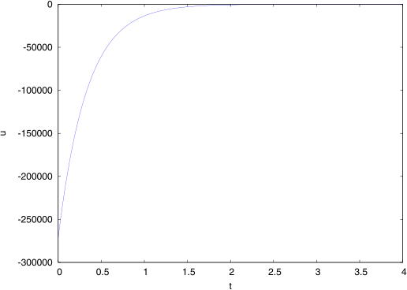
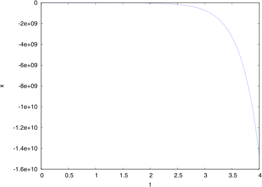

= Опыт использования свободного ПО в~экономико-математическом образовании на примере пакета `+Maxima+`

== Введение

Использование вычислительной техники в учебном процессе в высшей школе, в том
числе, экономико"=математическом образовании, уже давно стало традиционным.
Наиболее важной составляющей для последнего является обучение работе с ПО для
статистического анализа и математических расчётов.

Ввиду сложившихся особенностей процесса информатизации в нашей стране,
наибольшее распространение в высшем образовании получило закрытое ПО (если вести
речь о статистических и математических пакетах программ, то это `+STATISTICA+`,
`+SPSS+`, `+Mathematica+`, `+MathCAD+`, `+MATLAB+` и т. п.). Тем не менее, некоторые
изменения, главным образом, правового характера, произошедшие в последние годы,
привели к тому, что как в образовательных учреждениях (в среднем, среднем
специальном и высшем образовании), так и в государственных и коммерческих
структурах начинает применяться ПО свободное. Например, СПО (ещё до
развёртывания по государственной программе) использовалось в средних школах
с. Владимировка (Новосибирская обл.), с. Мисково (Костромская обл.) ,
с. Каргасок (Томская обл.), в МОУ СОШ № 1 г. Рубцовска (Алтайский край) , в МОУ
<<Гимназия>> им. С. В. Ковалевской, г. Великие Луки (Псковская обл.) ,
в гимназии № 88 г. Омска . Успешно СПО используют учреждения среднего
специального образования: Котласское речное училище , авиаколледж г. Рыльска
(Курская обл.) , Новооскольский сельскохозяйственный колледж , Камский
государственный автомеханический техникум (г. Набережные Челны)  и в высшей
школе: Восточный институт экономики, гуманитарных наук, управления и права
(ВЭГУ), г. Уфа , Нижегородский государственный технический университет , ГОУ ВПО
<<Ковровская государственная технологическая академия имени В. А. Дегтярёва>>,
г. Ковров (Владимирская обл.) , Санкт"=Петербургский государственный университет
информационных технологий, механики и оптики (СПбГУ ИТМО) ,
механико"=математический факультет Саратовского государственного университета ,
Санкт"=Петербургская академия управления и экономики (НОУ ВПО) . Более полный
список российских высших учебных заведений, использующих свободное программное
обеспечение (среди которых присутствуют Удмуртский государственный университет
и Ижевский государственный технический университет), доступен на сайте Центра
свободного программного обеспечения
в образованииfootnote:[http://www.fosscenter.ru/node/169.]. Органы
государственной власти также начинают мигрировать на СПО: например, его успешно
используют в администрации Псковской области  и в администрации Черниговского
района Приморского края . Всё более активно используют СПО коммерческие
предприятия "— например, оператор связи ООО <<Петрокрипт>>
(г. Санкт"=Петербург) , ООО <<Оптовик>> (г. Брянск) , компания оптовой торговли
<<Айс"=Логистик>> (г. Екатеринбург) , <<Воронежстройгаз>> (г. Воронеж) ,
компания <<Химреактивснаб>> (г. Уфа) , <<Мидитекс Инвест>>
(г. Ростов"=на"=Дону) , Правовое бизнес"=бюро <<Граф Маевский>>
(г. Санкт"=Петербург) , ЗАО <<Нано бокс>> (г. Санкт"=Петербург) .

В последнее время поддержка свободного программного обеспечения проводится на
государственном уровне: в октябре 2007 г. согласно Распоряжения Председателя
Правительства РФ № 1447-р., Министерству образования и науки и Министерству
связи выделено финансирование на решение, в частности, следующей задачи:
обеспечить разработку и внедрение в школы свободного программного обеспечения по
перечню программ, входящих в стандартный (базовый) пакет программного
обеспечения . По результатам проведённого тендера, разработку и внедрение ПСПО
проводила российская компания `+ALT Linux+`footnote:[http://www.altlinux.ru/.].
В рамках проекта была проведена пилотная апробация в школах Республики
Татарстан, Пермского края и Томской области . Некоторые школы приняли участие
в проекте по своей инициативе, причём число непилотных школ, присоединившихся
к проекту ПСПО, превысило число пилотных "— уже в марте 2009 г. было свыше 1130
таких заявок, тогда как число пилотных школ составило 1092 . Следует отметить,
что в различных странах ранее были реализованы аналогичные масштабные внедрения
свободного ПО в сфере образования (хотя и не столь масштабные, как это
предполагается сделать в России): это проекты 1998 г. в Мексике и провинции
Эстремадура в Испании, проект 2004 г. в Чили, внедрение 2005 г. в провинции
Цзянсу в Китае, а также длящиеся проекты по внедрению свободного ПО в школах
Македонии, штате Керала в Индии и кантоне Женева в Швейцарии. Мининформсвязи
России выработало <<Концепцию развития разработки и использования свободного
программного обеспечения в РФ>>.

Поддержка разработки и внедрения свободного программного обеспечения
в образовании и других сферах общественной, политической и экономической жизни
России проводится и различными негосударственными организациями "— такими, как
Центр свободных технологийfootnote:[http://www.centercest.ru/.] (ЦЕСТ),
Научно"=образовательный центр Института прикладной математики им. М. В. Келдыша
РАН (ИПМ РАН)footnote:[http://www.keldysh.ru/.], под руководством которого были
созданы интернет"=платформа для разработки <<Профессиональное свободное
программное обеспечение будущего>>footnote:[http://freetopsoft.ru/.]
и Сообщество свободного математического
моделированияfootnote:[http://www.mathmodel.ru/.], Центр свободного программного
обеспечения Елецкого государственного университета
им. И. А. Бунинаfootnote:[http://www.fosscenter.elsu.ru/.]. Центром
ИТ"=исследований и экспертизы Академии народного хозяйства при Правительстве
Российской Федерации создан проект INFO-FOSSfootnote:[http://info-foss.ru/.],
задачами которого объявлены: привлечение внимания государственных структур
к задачам поддержки развития свободного программного обеспечения и использования
открытых стандартов в России; поиск путей модернизации отдельных направлений
государственного управления на основе свободного программного обеспечения
и открытых стандартов; содействие развитию рынка свободного программного
обеспечения в России и повышение конкурентоспособности российского рынка ИКТ,
консолидация представителей рынка свободного программного обеспечения в России.
Ряд российских и зарубежных компаний и научных институтов объединились для
создания Российской ассоциации свободного программного обеспечения
(РАСПО)footnote:[http://www.raspo.ru/.]. Главной целью организации является
продвижение СПО на отечественном рынке. Создан также совместный проект
математического факультета МПГУ и `+ALT Linux+` <<Центр свободного программного
обеспечения в образовании>>footnote:[http://www.fosscenter.ru/.], основной
задачей которого является поддержка преподавателей и руководства средних,
средних специальных и высших образовательных учреждений в эффективном
использовании преимуществ свободного программного обеспечения в преподавании
и информационной инфраструктуре учебных заведений.

В целом же, как отмечает в своём отчёте М. Отставнов в той его части, которая
посвящена свободному ПО в системе образования, <<перспективы свободных программ
в программистском и околопрограммистском специальном образовании очевидны "—
методист и преподаватель, благодаря наличию доступа к исходным текстам может
,,лёгким движением руки“ превратить любую программу в учебное пособие. Позиции
`+Linux+` и особенно FreeBSD в ведущих технических вузах страны достаточно
сильны, и вряд ли что"=то этому может помешать. В непрограммистских
и нетехнических кругах ситуация много хуже "— огромный пул уже существующих
научных и учебных свободных программ (это тысячи пакетов и десятки тысяч
программ) не только не используется в должной мере, но и не систематизирован
и не описан на русском языке. Доходит до таких курьезов, как покупка лицензий
или ,,пиратское“ использование несвободных программ, для которых существует
масса свободных аналогов "— просто в силу неосведомлённости>> . Именно эту
неосведомлённость и пытаются ликвидировать, в частности, упомянутые выше
организации. Недостаток литературы по СПО на русском языке в последнее время
активно ликвидируется, в том числе, усилиями издательского отдела компании
`+ALT Linux+`footnote:[http://www.altlinux.org/Books:Main_page.].

== Свободное программное обеспечение. Его преимущества перед другими видами программ

Понятие свободного программного обеспечения было сформулировано Ричардом Мэттью
Столлманом, основателем проекта GNUfootnote:[http://www.gnu.org/.], Фонда
свободного программного обеспечения (`+Free Software Foundation+`,
FSF)footnote:[http://www.fsf.org/.] и Лиги за свободу программирования (League
for Programming Freedom, LPF)footnote:[http://progfree.org/.] и имеет четыре
критерия, по которым определяется свобода программного
обеспеченияfootnote:[http://www.gnu.org/philosophy/free-sw.html.]:

. Свобода запускать программу в любых целях (свобода 0).
. Свобода изучения работы программы и адаптация её к вашим нуждам (свобода 1).
Доступ к исходным текстам является необходимым условием.
. Свобода распространять копии, так что вы можете помочь вашему товарищу
(свобода 2).
. Свобода улучшать программу и публиковать ваши улучшения, так что всё общество
выиграет от этого (свобода 3). Доступ к исходным текстам является необходимым
условием.

Два из четырёх указанных выше критериев показывают, что доступ к исходным
текстам является необходимым условием для признания ПО свободным. Позднее
группой единомышленников был предложен термин << open source software>>
(программное обеспечение с открытым исходным кодом или открытое программное
обеспечение) "— способ разработки, при котором исходный текст доступен для
просмотра и изменения. Этот шаг был попыткой привлечь в мир свободного ПО новых
сторонников, в том числе из корпоративного мира. А именно, в 1998 г. Эриком
Рэймондом и Брюсом Перенсом была создана организация
<<`+Open Source Initiative+`>> (OSI)footnote:[http://opensource.org/.], целью
которой являлась популяризация свободных программ с экономической точки зрения.
Позже OSI опубликовала документ, озаглавленный <<Open Source
Definition>>footnote:[http://opensource.org/docs/osd.], который обозначал
требования к лицензии, которая могла бы называться открытой. В него входят
10 пунктов, частично схожих по своим требованиям с критериями свободного ПО.
Большинство открытого программного обеспечения является одновременно
и свободным. Как сказал Ричард Столлман, различия в двух подходов состоит в том,
что открытое ПО это лишь метод разработки, в то же время как свободное ПО это
социальное движение. Т. е., OSI в качестве приоритетного полагает
технологическое преимущество ПО с открытым исходным кодом, а FSF отдаёт
предпочтение вопросам, связанным с идеологией свободы программ. Часто эти две
категории программ объединяют под общим названием
`+Free/Libre and Open Source Software (FLOSS)+` или, более кратко,
`+Free and Open Source Software (FOSS)+`.

Использование свободного ПО имеет идеологические (то, что в проекте GNU
называется <<философией GNU>>), политические, экономические, технологические
и правовые аспекты.

Принципиальными преимуществами свободного программного обеспечения являются:

* Позволяет существенно снизить расходы на программное и аппаратное обеспечение
"— большинство открытого ПО имеет нулевую стоимость лицензии, и, как правило,
менее требовательно к аппаратному обеспечению, что позволяет сэкономить на его
покупке и продлить срок эксплуатации.
* Отсутствие зависимости клиента от поставщика решений.
* Стабильность и безопасность "— открытые продукты имеют большие сообщества
разработчиков и пользователей, привносящих свой вклад как в тестирование
продуктов, так и в разработку и улучшения. Эффективность открытого ПО была
доказана большим количеством компаний, извлёкших выгоду из его использования.
* Возможность быстрой и малозатратной кастомизации под специфичные нужды
клиента.

Широкое использование решений на базе свободного ПО в России позволит:

* обеспечить полноценное развитие отечественной отрасли информационных
технологий за счёт привлечения российских программистов к проектам разработки
и поддержки типовых тиражируемых ИТ"=решений на базе СПО;
* экономить на закупке программного обеспечения (свободное программное
обеспечение не требует лицензионных отчислений), кроме того, существенно
уменьшить отток средств за рубеж, что особенно важно в период мирового
финансового кризиса;
* обеспечить информационную безопасность страны (свободное ПО предлагает более
высокую надёжность и безопасность, чем закрытые продукты, кроме того, при
наличии полных исходных кодов программ всегда есть возможность убедиться
в отсутствии в ПО программных <<закладок>>) и обеспечить независимость от
технологической политики иностранных фирм"=производителей закрытых ИТ"=решений;
* снизить коррупцию, которая может сопровождать масштабные закупки
собственнического программного обеспечения, избавиться от необходимости
финансирования зарубежных разработчиков ПО в ущерб отечественным;
* снизить возможности для появления монополистов на рынке ИТ.

== Математическое ПО

Существует множество программ, предназначенных для математических расчётов.
Больше всего известны и широко распространены универсальные пакеты, при том, что
в количественном отношении преобладают программы, предназначенные для
использования в каких"=либо узкоспециализированных областях "— например,
GLPKfootnote:[http://www.gnu.org/software/glpk/.] (GNU Linear Programming Kit)
или GMP-ECMfootnote:[http://ecm.gforge.inria.fr/.].

По функциональности универсальные пакеты делятся в целом на две категории:
пакеты, предназначенные в основном для численных расчётов (например, `+MATLAB+`,
`+Octave+`, `+Scilab+`) и системы компьютерной алгебры
(`+Computer Algebra System+`, CAS), к которым относятся `+Mathematica+`,
`+Maple+`, `+Maxima+`, `+Axiom+`, отчасти `+MathCAD+` и др. "— они также
называются системами символьных или аналитических вычислений
(`+Symbolic Manipulation Program+`). Это наиболее универсальные математические
программы, способные решать самые разные задачи, причём как численно, так
и аналитически. Там, где необходимо выполнить вычисления точно, либо осуществить
аналитическое преобразование, например, упростить сложное математическое
выражение, вычислить в символьном виде производную или первообразную заданной
функции, разложить её в ряд Тейлора, найти корни уравнения, заданного
в достаточно общем виде, решить задачу Коши и т. д., как раз и применяются
системы компьютерной алгебры.

Следует отметить особую роль подобных систем в техническом и математическом
образовании "— они позволяют проверить результаты громоздких математических
расчётов и наглядно представить сложные математические объекты.

Некоторые из упомянутых пакетов (например, `+Mathematica+`, Maxima) являются
мультиплатформенными и могут работать в среде `+Microsoft Windows+`, `+Linux+`,
Mac OS X.

Среди свободных математических пакетов следует прежде всего упомянуть такие как
`+Axiom+`, `+Maxima+`, Octavefootnote:[http://www.octave.org/.],
Scilabfootnote:[http://www.scilab.org/.],
SAGEfootnote:[http://www.sagemath.org/.],
FreeMatfootnote:[http://freemat.sourceforge.net/.]. Для статистического анализа
существует свободный пакет ПО Rfootnote:[http://www.r-project.org/.], являющийся
едва ли не самым мощным пакетом для проведения статистических расчётов.

Порядок решения задач зависит от возможностей используемого пакета и имеет для
каждой системы свою специфику.

== Описание пакета Maxima

`+Maxima+` "— свободная система компьютерной алгебры, написанная на языке
`+Common Lisp+`. Пакет имеет широчайший набор средств для проведения
аналитических вычислений, численных вычислений и построения графиков. По набору
возможностей система сопоставима с такими закрытыми системами как `+Maple+`
и `+Mathematica+`. В то же время она обладает высочайшей степенью переносимости
"— она может работать на всех основных современных операционных системах на
компьютерах, начиная от самых мощных и вплоть до наладонных.

Как и большинство других систем компьютерной алгебры, `+Maxima+` имеет ядро
системы, производящее непосредственно вычисления, и пользовательский интерфейс,
позволяющий с этим ядром взаимодействовать. Сам пакет предоставляет интерфейс
командной строки, в котором в интерактивном режиме производятся все вычисления.
При этом все математические формулы отрисовываются обычными текстовыми символами
(с использованием, в том числе, псевдографики "— например, для отрисовки знаков
интеграла; формула при этом, даже если она короткая, может занимать несколько
строк текста). При работе в текстовом интерфейсе `+Maxima+` весьма
нетребовательна к оборудованию, т. е., способна работать даже на устаревшей
технике.

С другой стороны, имеется несколько графических интерфейсов пользователя для
работы с этим пакетом: `+Xmaxima+`, `+wxMaxima+` и др.

`+Xmaxima+`footnote:[
http://maxima.sourceforge.net/docs/xmaxima/xmaxima.html[
http://maxima.sourceforge.net/docs/xmaxima/xmaxima.html].] оснащена системой
меню и позволяет встраивать графические объекты прямо в документ в момент их
создания (по желанию пользователя), но математические знаки имитируются в ней,
так же как и в консольной версии, текстовыми символами.

В `+wxMaxima+`footnote:[http://wxmaxima.sourceforge.net/.] формулы вводятся
в текстовом виде, а вывод отображается графически, привычными математическими
символами; дополнительные кнопки и система меню позволяют вводить команды не
только в текстовом, но и в диалоговом режиме.

Один из наиболее интересных графических интерфейсов к `+Maxima+` предоставляет
`+GNU TeXmacs+`footnote:[http://www.texmacs.org/.]. `+TeXmacs+` "— платформа для
подготовки и редактирования документов со специальными возможностями для учёных.
Целью системы является создание унифицированной платформы для редактирования
структурированных документов с содержанием различного типа (текст, иллюстрации,
математические формулы, интерактивное содержание и т. д.). Ядро для отображения
использует высококачественные алгоритмы вёрстки для того, чтобы пользователь
получал профессионально подготовленные документы. В состав системы входит
текстовый редактор с поддержкой средств для редактирования формул, простых
технических иллюстраций. Более того, `+TeXmacs+` может использоваться в качестве
интерфейса ко многим компьютерным алгебраическим системам, системам численного
анализа, статистики и т. д. Пользователи могут создавать новые стили
визуализации, новые макросы, используя язык программирования Scheme.

`+TeXmacs+` доступен на всех основных клонах UNIX и для Windows. Документы можно
сохранять в формате `+GNU TeXmacs+`, XML или `+Scheme+`, опубликовать в виде
файлов `+PostScript+` или PDF. Существуют конвертеры форматов
TeX/LaTeX и HTML/MathML.

Имеются также интерфейсы `+Maxima+`, предоставляемые редактором Emacs:

. maxima "— интерактивный режим, аналогичен консольной версии `+Maxima+` или
интерфейсу `+Xmaxima+`. Кроме того, через него осуществляется взаимодействие
с процессом `+Maxima+` в интерфейсе `+maxima-mode+`.
. `+maxima-mode+` "— пакетный режим, аналогично обработке файлов `+Maxima+`.
Удобство режима заключается в том, что на выполнение можно отправлять как весь
файл (или буфер) так и отдельную его часть или одну строку. При первом вызове
порождается процесс Maxima, взаимодействие с которым осуществляется через
описанный выше интерфейс.
. `+imaxima+` "— интерактивный режим, аналогичен режиму `+Maxima+` за
исключением того, что вывод осуществляется не в текстовом, а в графическом виде,
похожем на интерфейс `+wxMaxima+`.
. `+EMaxima+` "— интерфейс, реализуемый внутри документа LaTeX.

Графические возможности реализованы в `+Maxima+` путём как встроенных средств
(`+openmath+`), так и взаимодействия с другим свободным ПО "—
Gnuplotfootnote:[http://www.gnuplot.info/.], самого мощного пакета для научной
графики.

`+Maxima+` имеет прекрасную документацию. Это, прежде всего, объёмистое
руководство от разработчиков, `+Maxima Reference Manual+`, и встроенная система
помощи и примеров, которую можно вызывать, в частности, при работе в текстовом
интерфейсе. Ссылки на большое количество различных материалов по пакету
(написанных разными авторами и на разных языках) имеются на странице
документации официального
сайтаfootnote:[http://maxima.sourceforge.net/documentation.html.]. На русском
языке публиковалось в журнале `+Linux Format+` руководство для начинающих
Т. Тарнавского.

== Использование Maxima в лабораторных занятиях по курсу <<Оптимальное управление>> КММЭ

Обучение на кафедре математических методов в экономике Института Экономики и
Управления УдГУ предполагает как изучение весьма широкого спектра математических
дисциплин, так и активное использование математических методов
в исследовательской работе. Применение при этом вычислительной техники,
оснащённой соответствующим ПО (в частности, какой"=либо СКА), представляется
вполне оправданным.

Автором статьи была использована СКА `+Maxima+` при проведении лабораторных
занятий по курсу <<Оптимальное управление>>. Для наиболее полного использования
потенциала свободного ПО, автором было принято решение об использовании ОС
`+GNU/Linux+` как платформы для использования данного пакета. Ввиду
скептического отношения руководства к установке `+GNU/Linux+` на технику
в компьютерном классе кафедры (при совместном использовании с предустановленной
ОС `+Microsoft Windows XP+`, реализованном в виде альтернативной загрузки), была
закуплена партия USB флеш"=накопителей для инсталляции на них GNU/Linux. На один
из этих накопителей автором статьи был установлен один из наиболее популярных
дистрибутивов `+GNU/Linux+` "— Debian, версии latexmath:[4.0] (Etch). Поскольку
`+Debian+` обладает самым большим репозиторием СПО, помимо базового комплекта ПО
общего назначения, были поставлены большинство пакетов математического
и статистического ПО (`+Maxima+`, `+Axiom+`, R и др.) и некоторые средства
разработки (такие как `+FreePascal+` и `+Lazarus+`, которые, в отличие от
известных пакетов фирмы `+Borland+` "— Turbo Pascal и `+Delphi+` "— могут
использоваться совершенно свободно). Сделано это было для удовлетворения
потребностей в соответствующем инструментарии заинтересовавшихся СПО студентов.
Процесс установки `+GNU/Linux+` на USB флеш"=накопитель абсолютно идентичен
установке этой ОС на жёсткий диск компьютера, и проводится с помощью штатного
инсталлятора. После подготовки <<начального>> флеш"=накопителя, содержимое его
было просто скопировано на другие базовыми средствами `+GNU/Linux+` (утилита dd
для поблочного копирования). В результате этой работы, студенты кафедры получили
в своё распоряжение полностью мобильную настроенную программную среду для
проведения математических расчётов и для использования другого установленного
СПО по своему выбору. Следует отметить, что среди пользователей
`+Microsoft Windows+` очень популярны, по понятным причинам, так называемые
`+portable+` версии программ, однако сама эта ОС не может быть установлена на
USB флеш"=накопитель, в отличие от `+GNU/Linux+`, когда пользователь получает
в `+portable+` виде полностью всю настроенную под свои нужды программную среду.
Такой накопитель может быть использован практически на любом более или менее
современном ПК, на котором есть порт USB версии 2.0, и в котором реализована
в BIOS загрузка с USB флеш"=накопителя. Аппаратное обеспечение, в отличие от
`+Microsoft Windows+`, настраивается в `+GNU/Linux+` при каждой загрузке ОС
полностью в автоматическом режиме, не требуя никакой перенастройки или установки
дополнительных драйверов и т. д. Поэтому подготовленные флеш"=накопители могут
быть использованы не только в компьютерном классе кафедры, но и, например,
в домашних компьютерах студентов.

На лабораторных занятиях студенты прежде всего были ознакомлены с основами
работы в ОС `+GNU/Linux+`. Для наиболее эффективного использования данная ОС
требует достаточно долгого времени обучения, так как стиль эффективной работы
в ней существенно отличается от стиля работы, привычного пользователям
`+Microsoft Windows+`. Тем не менее, современное пользовательское окружение
позволяет использовать GNU/Linux и в привычном пользователям
`+Microsoft Windows+` стиле, что требует совсем небольших затрат времени на
начальное обучение (особенно это касается опытных пользователей ПК). Каких"=либо
серьёзных затруднений при работе в новой (для большинства) ОС студенты не
испытали.

После этого группой был освоен базовый курс работы в `+Maxima+`, который включал
в себя следующие темы:

* арифметические вычисления,
* точные и приближённые вычисления,
* использование результатов предыдущих вычислений,
* константы, переменные и функции,
* последовательность вычислений,
* подстановка значений,
* некоторые элементарные функции,
* списки,
* графики,
* решение уравнений,
* векторы, матрицы и определители,
* алгебраические рациональные выражения,
* упрощение выражений,
* пределы,
* производные и дифференциалы,
* интегрирование,
* суммы, произведения и ряды,
* блокировка вычислений,
* дифференциальные уравнения и системы,
* максимизация и минимизация, линейное программирование.

Завершением лабораторных занятий по курсу был разбор решений с использованием
данного пакета типовых задач оптимального управления (для этого использовался
набор задач из книги Б. А. Лагоши и Т. Г. Апальковой ).

В качестве примера решения в пакете `+Maxima+` рассмотрим нелинейную задачу без
ограничений на управление. Решим её методом Лагранжа "— Понтрягина, используя
графический интерфейс к `+Maxima+` редактора `+TeXmacs+`.

[latexmath]
++++
\begin{aligned}
&J = \int\limits_{0}^{4} \left(2u + u^2 - x\right)\,dt + 2x(4)
\rightarrow \min;\\
&x' = 3x + 2u;\\
&x(0) = 0.\end{aligned}
++++

latexmath:[{f_0 (x, u) :=2 u + u^2 - x}]$

latexmath:[{f (x, u) :=3 x + 2 u}]$

latexmath:[{F (x) :=2 x}]$

latexmath:[{H (\psi, x, u) :=\psi f (x, u) - f_0 (x, u)}]$

latexmath:[{\ensuremath{\operatorname{ev}} (H (\psi, x, u))}]

latexmath:[{\ensuremath{\operatorname{ratcoeff}} (\%, u)}]

latexmath:[{\ensuremath{\operatorname{diff}} (H (\psi, x, u), u)}]

latexmath:[{\ensuremath{\operatorname{solve}} (\%, u)}]

latexmath:[{\ensuremath{\operatorname{diff}} (H (\psi, x, u), u, 2)}]

latexmath:[{\ensuremath{\operatorname{diff}} (H (\psi, x, u), x)}]

latexmath:[{\ensuremath{\operatorname{diff}} (F (x), x)}]

latexmath:[{\ensuremath{\operatorname{deq}} 1 : \text{'} \ensuremath{\operatorname{diff}} (x (t), t) = 3 x (t) + 2
(\psi (t) - 1)}]

latexmath:[{\ensuremath{\operatorname{deq}} 2 : \text{'} \ensuremath{\operatorname{diff}} (\psi (t), t) = - (3
\psi (t) + 1)}]

latexmath:[{\ensuremath{\operatorname{atvalue}} (x (t), t = 0, 0)}]

latexmath:[{\ensuremath{\operatorname{dsol}} : \ensuremath{\operatorname{desolve}} ([\ensuremath{\operatorname{deq}} 1, \ensuremath{\operatorname{deq}} 2],
[x (t), \psi (t)])}]$

latexmath:[{\ensuremath{\operatorname{bc}} : \ensuremath{\operatorname{subst}} (4, t, \ensuremath{\operatorname{rhs}} (\ensuremath{\operatorname{dsol}}
[2])) = - 2}]$

latexmath:[{\ensuremath{\operatorname{dsol}} : \ensuremath{\operatorname{eliminate}} (\ensuremath{\operatorname{append}} (\ensuremath{\operatorname{dsol}},
[\ensuremath{\operatorname{bc}}]), [\psi (0)])}]$

latexmath:[{\ensuremath{\operatorname{dsol}} : \ensuremath{\operatorname{solve}} (\ensuremath{\operatorname{dsol}}, [x (t), \psi
(t)])}]$

latexmath:[{\ensuremath{\operatorname{expand}} (\ensuremath{\operatorname{rhs}} (\ensuremath{\operatorname{dsol}} [1] [1]))}]

latexmath:[{\ensuremath{\operatorname{expand}} (\ensuremath{\operatorname{rhs}} (\ensuremath{\operatorname{dsol}} [1] [2]))}]

latexmath:[{\psi (t) :=- \frac{5 \mathrm{e}^{12 - 3 t}}{3} -
\frac{1}{3}}]$

latexmath:[{x (t) :=- \frac{5 \mathrm{e}^{3 t + 12}}{9} - \frac{8
\mathrm{e}^{3 t}}{9} + \frac{5 \mathrm{e}^{12 - 3 t}}{9} + \frac{8}{9}}]$

latexmath:[{u (t) :=\psi (t) - 1}]$

latexmath:[{\ensuremath{\operatorname{ev}} (u (t))}]

latexmath:[{u (t) :=- \frac{5 \mathrm{e}^{12 - 3 t}}{3} -
\frac{4}{3}}]$

latexmath:[{\ensuremath{\operatorname{plot}} 2 d (u (t), [t, 0, 4])}]$

latexmath:[{\ensuremath{\operatorname{plot}} 2 d (x (t), [t, 0, 4])}]$

Графики функции управления latexmath:[u(t)] и функции latexmath:[x(t)]
приводятся на рисунках #Drawing:u[1] и #Drawing:x[2] соответственно.

]

]

99 `+Free Software+` для спецоператора. // `+Linux Format+`. 2007. № 98
(Ноябрь). С. 50—51. `+GNU/Linux+` в Северной столице. // `+Linux Format+`. 2008.
№ 105 (Май). С. 105—107. `+GNU/Linux+` в селе Владимировка. // `+Linux Format+`.
2008. № 103 (Март). С. 104—105. `+Linux+` для снабженцев Екатеринбурга. //
Linux Format. 2008. № 103 (Март). С. 26. `+GNU/Linux+` покоряет Уфу.
// `+Linux Format+`. 2007. № 99 (Декабрь). С. 125—127. `+Nano+`, но не
то…// `+Linux Format+`. 2008. № 110 (Октябрь). С. 26—27. `+Unix+` в школе.
// `+Linux Format+`. 2009. № 113—114 (Январь). С. 22—23. Авиаторы выбирают
`+GNU/Linux+`. // `+Linux Format+`. 2008. № 103 (Март). С. 99—103. Администрация
Псковской области и её компьютеры. // `+Linux Format+`. 2008. № 108 (Август).
С. 48—49. Бизнес работает для школы. // `+Linux Format+`. 2008. № 104 (Апрель).
С. 52—54. Будущее КамАЗа обучается на `+GNU/Linux+`. //  Linux Format. 2008.
№ 106 (Июнь). С. 112—113. Воронежстройгаз внедряет `+Fedora+`.
// `+Linux Format+`. 2008. № 105 (Май). С. 26—29. Всё для ваших лабораторий:
теперь с `+GNU/Linux+`. // Linux Format. 2008. № 106 (Июнь). С. 52—54. Дорогу
осилит идущий. // `+Linux Format+`. 2008. № 110 (Октябрь). С. 104—105. Когда мне
всё это надоело…// `+Linux Format+`. 2008. № 108 (Август). С. 98—99. Котласские
речники выбирают `+GNU/Linux+`. //  Linux Format. 2007. № 99 (Декабрь).
С. 122—124. Лагоша Б. А., Апалькова Т. Г. Оптимальное управление в экономике.
Теория и приложения. М.: Финансы и статистика, 2008. 224 c. Любопытство и до
`+GNU/Linux+` доведёт. //  Linux Format. 2008. 107 (Июль). С. 100—102.
Математики из Саратова выбирают `+GNU/Linux+`. // Linux Format. 2008. № 108
(Август). С. 96—97. Непилотных больше, чем пилотных.
http://freeschool.altlinux.ru/?p=1402. Непростые юристы есть
в Санкт"=Петербурге. // Linux Format. 2008. № 109 (Сентябрь). С. 28—29.
Нижегородский технический. // `+Linux Format+`. 2008. № 100—101 (Январь).
С. 112—113. Оптовая торговля с `+GNU/Linux+`. // `+Linux Format+`. 2008.
№ 100—101 (Январь). С. 34—35. Отставнов М. Перспективы свободного программного
обеспечения в сфере государственного управления и бюджетном секторе экономики.
Глава 2 из отчёта Фонда <<Новая экономика>> Министерству экономического развития
и торговли по теме <<Анализ результатов и разработка предложений по созданию
механизмов поддержки (в том числе за счёт средств федерального бюджета) проектов
по использованию ИКТ в экономике, социальной сфере, государственном управлении
на региональном и муниципальном уровнях власти>>.
http://www.linuxlib.ru/other/freeMERT.html. Пингвины на медвежьем мысу.
// `+Linux Format+`. 2008. № 110 (Октябрь). С. 102—103. Распоряжение
Правительства Российской Федерации от 18 октября 2007 г. № 1447-р, г. Москва. //
Российская газета. 24.10.2009. http://www.rg.ru/2007/10/24/shkoly-soft-dok.html.
С `+GNU/Linux+` поладит даже историк. // `+Linux Format+`. 2008. № 103 (Март).
С. 109—110. СПО в российских школах. http://freeschool.altlinux.ru/?page_id=2.
СПО районного масштаба. // `+Linux Format+`. 2008. № 111 (Ноябрь). С. 104—105.
Тарнавский Т. `+Maxima+` "— максимум свободы символьных вычислений.
// `+Linux Format+`. 2006. № 81—86. Технари из города оружейников выбирают
`+GNU/Linux+`. // `+Linux Format+`. 2008. № 104 (Апрель). С. 111—112.
Экспериментальная проверка `+GNU/Linux+` в Ростове"=на"=Дону.
// `+Linux Format+`. 2008. № 107 (Июль). С. 50—52.
